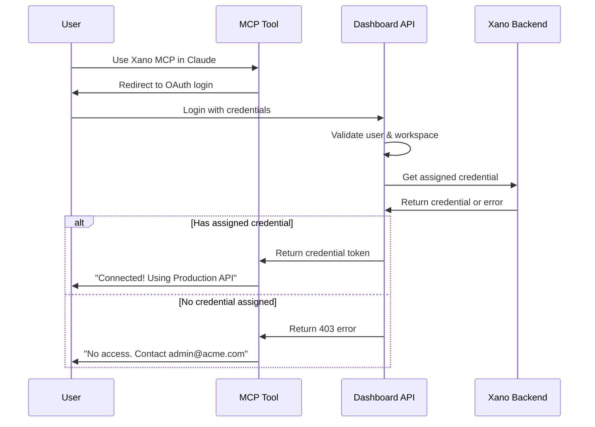

# Product Requirements Document: Multi-Tool MCP Dashboard

## 1. Executive Summary

### 1.1 Product Overview

The Multi-Tool MCP Dashboard is a multi-tenant SaaS platform that manages credential distribution and usage analytics for Model Context Protocol (MCP) tools. Each MCP tool (Xano, Universe, etc.) has its own separate interface and user base. The platform enables workspace owners to save multiple credentials for their tool and assign specific credentials to team members, controlling what access each member has when using the MCP tool in Claude or other AI assistants.

### 1.2 Key Features

- **Multi-Tenant Workspaces**: Organization-level containers for credential management
- **Credential Assignment**: Save multiple API keys/credentials and assign specific ones to team members
- **Access Control**: Turn member access on/off, assign different credentials for different permission levels
- **Usage Analytics**: Track which credentials are being used and by whom
- **Security Management**: Know what credentials are active, who has access, and revoke when needed
- **OAuth Integration**: Seamless credential retrieval during MCP tool authentication flow

### 1.3 Target Users

- **For Xano MCP**: Developers/agencies managing multiple Xano instances and API keys
- **For Universe MCP**: Companies with MultiValue databases needing credential distribution
- **Common Needs**: Teams wanting to control and monitor credential access for their MCP tools

## 2. Architecture Overview

### 2.1 Core Concept

```
Workspace Owner's Perspective:
┌─────────────────────────────────────────────────┐
│                 WORKSPACE                       │
├─────────────────────────────────────────────────┤
│  Saved Credentials:                             │
│  • Production API Key (full access)             │
│  • Staging API Key (read-only)                  │
│  • Client A API Key (custom permissions)        │
│  • Client B API Key (limited tables)            │
├─────────────────────────────────────────────────┤
│  Team Members:                                  │
│  • John → assigned Production API Key           │
│  • Sarah → assigned Staging API Key             │
│  • Mike → assigned Client A API Key             │
│  • Lisa → NO ACCESS (turned off)                │
└─────────────────────────────────────────────────┘

When team member uses MCP tool in Claude:
1. Member authenticates via OAuth
2. System returns their assigned credential
3. All MCP operations use that credential
```

### 2.2 Credential Assignment Flow

```
1. Owner saves multiple credentials in dashboard
   ↓
2. Owner assigns specific credential to team member
   ↓
3. Member uses MCP tool in Claude
   ↓
4. OAuth flow identifies member
   ↓
5. System returns assigned credential
   ↓
6. Member operates with that credential's permissions
```

### 2.3 Database Schema (Existing)

#### Core Tables

- `workspaces` - Multi-tenant organizations
- `workspace_members` - Team members with credential assignments
- `workspace_settings` - Configuration per workspace
- `workspace_invitations` - Pending invitations

#### Credential Storage Tables

**For Xano MCP:**
- `xano_credentials` - User's saved Xano API keys (multiple per workspace)
- `xano_api_keys` - Workspace-level API key assignments to members

**For Universe MCP:**
- `universe_connections` - Saved Universe database credentials

**Future Tools:**
- `airtable_credentials` - Airtable API credentials
- `freshbooks_credentials` - FreshBooks OAuth tokens

#### Analytics Tables

- `xano_mcp_logs` - Detailed API call logs per credential
- `xano_mcp_metrics` - Aggregated metrics
- `activity_logs` - Audit trail of credential assignments
- `api_usage` - Usage tracking per member/credential

## 3. User Roles & Permissions

### 3.1 Workspace Roles

1. **Owner**
   - Save and manage all credentials
   - Assign credentials to team members
   - Turn member access on/off
   - View all usage analytics
   - Manage billing

2. **Admin**
   - Save and manage credentials
   - Assign credentials to members (except owner)
   - View all analytics
   - Cannot change billing

3. **Member**
   - Use assigned credential only
   - View own usage statistics
   - Cannot see or manage credentials
   - Cannot see what credential they're using

4. **Viewer**
   - View analytics only
   - No credential access
   - Cannot make API calls

### 3.2 Credential Assignment Model

Instead of generic "tool access", members are assigned specific credentials:

```json
{
  "workspace_member": {
    "user_id": "usr_123",
    "role": "member",
    "assigned_credential": {
      "xano": "cred_456",  // Specific credential ID
      "universe": "conn_789"
    }
  }
}
```

When the member uses the MCP tool, they automatically use their assigned credential.

## 4. API Endpoints

### 4.1 Workspace Management

#### List User's Workspaces
```
GET /api/workspaces
Response: {
  "workspaces": [{
    "id": "ws_123",
    "name": "Acme Corp",
    "role": "admin",
    "active_tools": ["xano", "universe"],
    "member_count": 5,
    "created_at": "2025-01-01T00:00:00Z"
  }]
}
```

#### Get Workspace Details
```
GET /api/workspaces/{id}
Response: {
  "id": "ws_123",
  "name": "Acme Corp",
  "owner": { "id": "usr_456", "name": "John Doe" },
  "subscription": {
    "plan": "pro",
    "status": "active",
    "limits": {
      "members": 10,
      "api_calls": 100000,
      "tools": 5
    }
  },
  "enabled_tools": ["xano", "universe"],
  "statistics": {
    "total_members": 5,
    "total_api_calls": 45000,
    "active_credentials": 8
  }
}
```

#### Update Workspace
```
PATCH /api/workspaces/{id}
Body: {
  "name": "Acme Corporation",
  "description": "Main development workspace"
}
```

#### Switch Active Workspace
```
POST /api/workspaces/{id}/activate
Response: {
  "success": true,
  "workspace_id": "ws_123"
}
```

### 4.2 Credential Management

#### List Workspace Credentials (Xano)
```
GET /api/workspaces/{id}/xano/credentials
Response: {
  "credentials": [{
    "id": "cred_123",
    "name": "Production API Key",
    "description": "Full access to production",
    "created_at": "2025-01-01T00:00:00Z",
    "created_by": "John Doe",
    "assigned_to_count": 3,
    "last_used": "2025-01-20T10:00:00Z"
  }, {
    "id": "cred_456",
    "name": "Staging API Key",
    "description": "Read-only access",
    "assigned_to_count": 5
  }]
}
```

#### Save New Credential (Xano)
```
POST /api/workspaces/{id}/xano/credentials
Body: {
  "credential_name": "Client A API Key",
  "description": "Limited access for Client A project",
  "xano_api_key": "xano_live_key_..."
}
```

#### Assign Credential to Member
```
PUT /api/members/{member_id}/credentials/xano
Body: {
  "credential_id": "cred_123"
}
Response: {
  "success": true,
  "member": "john@company.com",
  "assigned_credential": "Production API Key"
}
```

#### Remove Member Access
```
DELETE /api/members/{member_id}/credentials/xano
Response: {
  "success": true,
  "access_revoked": true
}
```

### 4.3 Team Management

#### Send Invitation
```
POST /api/workspaces/{id}/invitations
Body: {
  "email": "newdev@acme.com",
  "role": "member",
  "assigned_credentials": {
    "xano": "cred_456"  // Assign staging key to new member
  },
  "message": "Welcome to our dev team!"
}
```

#### List Workspace Members
```
GET /api/workspaces/{id}/members
Response: {
  "members": [{
    "id": "mem_123",
    "user": {
      "id": "usr_789",
      "name": "Jane Smith",
      "email": "jane@acme.com"
    },
    "role": "admin",
    "status": "active",
    "assigned_credentials": {
      "xano": {
        "credential_id": "cred_123",
        "credential_name": "Production API Key",
        "has_access": true
      }
    },
    "joined_at": "2025-01-01T00:00:00Z",
    "last_active": "2025-01-20T10:30:00Z",
    "usage_stats": {
      "total_api_calls": 5000,
      "by_credential": {
        "cred_123": 5000
      }
    }
  }]
}
```

#### Update Member Role
```
PATCH /api/members/{id}/role
Body: {
  "role": "admin"
}
```

### 4.3 Multi-Tool Credential Management

#### Generic Pattern
```
# Add credential for any tool
POST /api/workspaces/{id}/tools/{tool_name}/credentials
Body: {
  "name": "Production API Key",
  "credentials": {
    "api_key": "xano_key_123...",  // Tool-specific format
    "instance_url": "myapp.xano.io"
  }
}

# List credentials for a tool
GET /api/workspaces/{id}/tools/{tool_name}/credentials
Response: {
  "credentials": [{
    "id": "cred_123",
    "name": "Production API Key",
    "created_by": "John Doe",
    "created_at": "2025-01-01T00:00:00Z",
    "last_used": "2025-01-20T10:00:00Z",
    "status": "active"
  }]
}
```

#### Tool-Specific Examples

**Xano:**
```
POST /api/workspaces/{id}/tools/xano/credentials
Body: {
  "credential_name": "Production Xano",
  "xano_api_key": "xano_live_key_...",
  "instance_name": "myapp.n7.xano.io"
}
```

**Universe:**
```
POST /api/workspaces/{id}/tools/universe/connections
Body: {
  "connection_name": "Main Universe DB",
  "host": "universe.company.com",
  "port": 31438,
  "account": "production",
  "password": "encrypted_password"
}
```

### 4.4 Analytics & Usage

#### Get Dashboard Overview
```
GET /api/dashboard?period=week
Response: {
  "workspace": {
    "id": "ws_123",
    "name": "Acme Corp"
  },
  "summary": {
    "total_api_calls": 45000,
    "success_rate": 98.5,
    "active_members": 5,
    "active_credentials": {
      "xano": 3,  // 3 different Xano credentials in use
      "universe": 2
    }
  },
  "credential_breakdown": [{
    "credential_id": "cred_123",
    "credential_name": "Production API Key",
    "tool": "xano",
    "calls": 25000,
    "errors": 100,
    "assigned_to_count": 3,
    "top_users": ["john@acme.com", "jane@acme.com"]
  }, {
    "credential_id": "cred_456",
    "credential_name": "Staging API Key",
    "tool": "xano",
    "calls": 5000,
    "errors": 50,
    "assigned_to_count": 2
  }],
  "member_activity": [{
    "user": "jane@acme.com",
    "calls": 15000,
    "credentials_used": {
      "xano": "Production API Key",
      "universe": "Main DB Connection"
    }
  }]
}
```

#### Get Credential-Specific Analytics
```
GET /api/analytics/credentials/{credential_id}?period=month
Response: {
  "credential": {
    "id": "cred_123",
    "name": "Production API Key",
    "tool": "xano"
  },
  "period": {
    "start": "2025-01-01",
    "end": "2025-01-31"
  },
  "metrics": {
    "total_calls": 25000,
    "unique_operations": 45,
    "error_rate": 0.4,
    "avg_response_time": 110
  },
  "users_breakdown": [{
    "user": "john@acme.com",
    "calls": 15000,
    "last_used": "2025-01-31T10:00:00Z"
  }, {
    "user": "jane@acme.com",
    "calls": 10000,
    "last_used": "2025-01-31T09:30:00Z"
  }],
  "top_operations": [{
    "operation": "list_tables",
    "calls": 5000,
    "avg_duration": 100
  }],
  "daily_breakdown": [{
    "date": "2025-01-20",
    "calls": 1200,
    "errors": 3
  }]
}
```

#### Get Member Activity
```
GET /api/analytics/members/{id}/activity
Response: {
  "member": {
    "id": "mem_123",
    "name": "Jane Smith"
  },
  "activity": {
    "last_7_days": {
      "total_calls": 500,
      "tools_used": {
        "xano": 300,
        "universe": 200
      },
      "error_rate": 1.2
    },
    "recent_operations": [{
      "timestamp": "2025-01-20T10:30:00Z",
      "tool": "xano",
      "operation": "create_table",
      "duration_ms": 150,
      "status": "success"
    }]
  }
}
```

### 4.5 OAuth Integration Endpoint

#### Get Assigned Credential for MCP Tool
```
POST /api/auth/mcp/token
Headers: {
  "Authorization": "Bearer {oauth_token}"
}
Body: {
  "tool": "xano",
  "workspace_id": "ws_123"  // Optional, uses default workspace if not provided
}
Response: {
  "success": true,
  "credential": {
    "type": "xano_api_key",
    "value": "xano_live_key_...",  // The actual API key assigned to this user
    "instance_url": "myapp.n7.xano.io",
    "permissions": "production_full_access"
  },
  "workspace": {
    "id": "ws_123",
    "name": "Acme Corp"
  },
  "expires_in": 3600  // Token expiration
}
```

#### OAuth Error Responses
```
// No credential assigned
403 Forbidden
{
  "error": "no_credential_assigned",
  "message": "You don't have access to Xano MCP in this workspace. Contact your workspace admin.",
  "workspace": "Acme Corp",
  "admin_email": "admin@acme.com"
}

// Access turned off
403 Forbidden
{
  "error": "access_disabled",
  "message": "Your Xano MCP access has been temporarily disabled.",
  "contact": "admin@acme.com"
}
```

### 4.6 Usage & Limits

#### Get Workspace Usage
```
GET /api/workspaces/{id}/usage
Response: {
  "period": "current_month",
  "usage": {
    "api_calls": {
      "used": 45000,
      "limit": 100000,
      "percentage": 45,
      "by_credential": {
        "cred_123": {
          "name": "Production API Key",
          "calls": 25000,
          "assigned_to": 3
        },
        "cred_456": {
          "name": "Staging API Key",
          "calls": 5000,
          "assigned_to": 2
        },
        "cred_789": {
          "name": "Client A API Key",
          "calls": 15000,
          "assigned_to": 1
        }
      }
    },
    "members": {
      "total": 10,
      "with_access": 6,  // Members with at least one credential
      "active_today": 4
    },
    "credentials": {
      "total_saved": 8,
      "actively_used": 5,
      "by_tool": {
        "xano": 3,
        "universe": 2,
        "airtable": 3
      }
    }
  },
  "alerts": [{
    "type": "high_usage",
    "credential": "Production API Key",
    "message": "80% of monthly limit reached"
  }]
}
```

## 5. Frontend Requirements

### 5.1 Dashboard Views

#### 5.1.1 Overview Dashboard
- Workspace selector (dropdown)
- Key metrics cards (API calls, success rate, active tools)
- Usage chart (line graph showing trends)
- Recent activity feed
- Quick actions (invite member, add tool)

#### 5.1.2 Team Management
- Members table with:
  - Name, email, role badge
  - Tool access icons
  - Last active timestamp
  - Usage sparkline
  - Actions (edit, remove)
- Invitation form with tool access checkboxes
- Pending invitations list

#### 5.1.3 Tool Management
- Tool marketplace grid
  - Tool cards with icon, name, description
  - Enable/disable toggle
  - Credential count badge
  - "Configure" button
- Enabled tools section
  - Credential management per tool
  - Tool-specific settings
  - Usage statistics

#### 5.1.4 Analytics
- Time period selector
- Aggregate metrics across all tools
- Tool comparison chart
- Member leaderboard
- Error tracking and debugging

### 5.2 Role-Based UI

#### Owner/Admin View
- Full credential management
  - Add/edit/delete credentials
  - See all saved credentials with unmask option
  - Assign credentials to any team member
  - View per-credential usage analytics
- Team management
  - Invite members with pre-assigned credentials
  - Change member credential assignments
  - Turn member access on/off
- Billing and subscription control

#### Member View
- Cannot see credential management section
- Cannot see which specific credential they're using
- Only see "You have access to Xano MCP" indicator
- View own usage statistics
- Cannot invite team members or change assignments

#### Viewer View
- Read-only analytics by credential
- Cannot see actual credential values
- No access to make API calls
- Export capabilities with watermark

### 5.3 Key UI Components

#### Credential Manager (Owner View)
```jsx
<CredentialCard>
  <CredentialName>Production API Key</CredentialName>
  <CredentialPreview>xano_live_ab12****</CredentialPreview>
  <AssignedMembers>
    <Avatar>JD</Avatar>
    <Avatar>JS</Avatar>
    <Text>+2 more</Text>
  </AssignedMembers>
  <Stats>
    <Usage>25k API calls this month</Usage>
    <LastUsed>Active now</LastUsed>
  </Stats>
  <Actions>
    <AssignButton />
    <TestButton />
    <EditButton />
    <DeleteButton />
  </Actions>
</CredentialCard>
```

#### Member Credential Assignment
```jsx
<MemberCredentialAssignment member={member}>
  <MemberInfo>
    <Avatar>JS</Avatar>
    <Name>Jane Smith</Name>
    <Email>jane@acme.com</Email>
  </MemberInfo>
  <CredentialSelector>
    <Select defaultValue="cred_123">
      <Option value="none">No Access</Option>
      <Option value="cred_123">Production API Key</Option>
      <Option value="cred_456">Staging API Key</Option>
      <Option value="cred_789">Client A API Key</Option>
    </Select>
  </CredentialSelector>
  <Toggle label="Access Enabled" checked={true} />
</MemberCredentialAssignment>
```

#### Invitation with Credential Pre-assignment
```jsx
<InvitationForm>
  <EmailInput />
  <RoleSelector />
  <CredentialAssignments>
    <Label>Assign Xano Credential</Label>
    <Select>
      <Option value="none">No Access</Option>
      <Option value="cred_456">Staging API Key (Limited)</Option>
      <Option value="cred_123">Production API Key (Full)</Option>
    </Select>
  </CredentialAssignments>
  <SendButton>Send Invitation</SendButton>
</InvitationForm>
```

#### Usage Meter
```jsx
<UsageMeter>
  <Progress value={45} max={100} />
  <Stats>
    <Used>45,000 API calls</Used>
    <Limit>100,000 limit</Limit>
    <Remaining>55,000 remaining</Remaining>
  </Stats>
</UsageMeter>
```

## 6. Security Requirements

### 6.1 Authentication & Authorization
- JWT-based authentication
- Workspace-scoped access tokens
- Role-based middleware on all endpoints
- Session timeout after 7 days

### 6.2 Credential Security
- API keys hashed with SHA-256
- Only store key prefix for display
- Encryption at rest for sensitive data
- Audit log for credential access

### 6.3 Data Isolation
- Strict workspace isolation
- Row-level security in database
- No cross-workspace data leakage
- Separate credential storage per tool

## 7. Technical Implementation

### 7.1 Backend Stack
- **Database**: Xano (existing)
- **API**: RESTful endpoints in Xano
- **Authentication**: Xano's built-in auth
- **File Storage**: Xano file management

### 7.2 Frontend Stack
- **Framework**: Next.js 14 (App Router)
- **UI Library**: shadcn/ui
- **State Management**: Zustand
- **API Client**: Axios with interceptors
- **Charts**: Recharts
- **Forms**: React Hook Form + Zod

### 7.3 Deployment
- **Frontend**: Vercel
- **Backend**: Xano Cloud
- **Monitoring**: Xano built-in analytics
- **Error Tracking**: Sentry integration

## 8. Development Phases

### Phase 1: Core Credential Management (Week 1-2)
- Credential CRUD operations per tool
- Secure storage with encryption
- Credential validation endpoints
- Basic assignment to members

### Phase 2: OAuth Integration (Week 2-3)
- OAuth endpoint for MCP tools
- Credential retrieval based on member assignment
- Error handling for no access scenarios
- Token management and expiration

### Phase 3: Team & Assignment System (Week 3-4)
- Member invitation with credential pre-assignment
- Credential assignment UI
- Access on/off toggles
- Assignment history tracking

### Phase 4: Analytics by Credential (Week 5-6)
- Per-credential usage tracking
- Member activity by credential
- Credential performance metrics
- Usage alerts and limits

### Phase 5: Advanced Features (Week 7+)
- Multiple workspace support
- Credential rotation policies
- Advanced permission templates
- Audit logging and compliance

## 9. Success Metrics

### 9.1 Technical KPIs
- API response time < 200ms (p95)
- Dashboard load time < 2 seconds
- 99.9% uptime
- Zero security breaches

### 9.2 Business KPIs
- 50+ workspaces in first month
- 3+ tools per workspace average
- < 5% churn rate
- 80% daily active users

### 9.3 User Satisfaction
- NPS score > 50
- Support ticket resolution < 24 hours
- Feature adoption rate > 60%
- User onboarding completion > 90%

## 10. Future Enhancements

### 10.1 Short Term (3-6 months)
- Credential templates for common permission sets
- Bulk credential assignment
- Credential expiration and rotation
- Usage-based credential recommendations
- Slack notifications for credential events

### 10.2 Long Term (6-12 months)
- Multi-workspace credential sharing
- Credential marketplace (share read-only credentials)
- Advanced compliance features (SOC2, HIPAA)
- AI-powered credential optimization
- Enterprise federation for credential management

## 11. Risks & Mitigation

### 11.1 Technical Risks
- **Risk**: API rate limits from tools
- **Mitigation**: Implement caching and request queuing

### 11.2 Security Risks
- **Risk**: Credential exposure
- **Mitigation**: Encryption, audit logs, key rotation

### 11.3 Business Risks
- **Risk**: Tool API changes
- **Mitigation**: Version management, backward compatibility

## 12. Appendix

### 12.1 Database Schema Details
[See existing schema in Section 2.2]

### 12.2 API Error Codes
- 400: Bad Request
- 401: Unauthorized  
- 403: Forbidden (insufficient permissions)
- 404: Resource not found
- 429: Rate limit exceeded
- 500: Internal server error

#### Credential-Specific Errors
- 403: no_credential_assigned - Member has no credential for this tool
- 403: access_disabled - Member's access has been turned off
- 403: credential_expired - Assigned credential has expired
- 403: credential_deleted - Assigned credential no longer exists

### 12.3 Webhook Events
- workspace.created
- member.invited
- member.joined
- credential.created
- credential.assigned
- credential.unassigned  
- credential.deleted
- member.access.enabled
- member.access.disabled
- usage.limit.warning (per credential)
- usage.limit.exceeded (per credential)

### 12.4 Example OAuth Flow for MCP Tools

