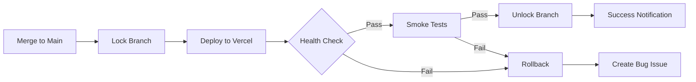

# Specialized AI Agents for Xano MCP Ecosystem

## Executive Summary

This document defines a comprehensive framework for specialized AI agents that autonomously execute tasks within the Xano MCP ecosystem. These agents are designed to operate continuously without human intervention, self-improve through experience, and collaborate effectively to deliver measurable business value.

## Table of Contents

1. [Core Agent Design Principles](#core-agent-design-principles)
2. [Agent Catalog](#agent-catalog)
3. [Autonomous Execution Patterns](#autonomous-execution-patterns)
4. [Production Architecture](#production-architecture)
5. [Implementation Roadmap](#implementation-roadmap)

## Core Agent Design Principles

### 1. Autonomy Spectrum

Agents operate on three levels of autonomy:

- **Reactive (Level 1)**: Execute predefined tasks with minimal adaptation
- **Adaptive (Level 2)**: Learn from experience and adjust strategies
- **Self-Directed (Level 3)**: Generate own goals and evolve behavior

### 2. Success Criteria & Self-Validation

Each agent must have:
- Binary success definition (pass/fail)
- Self-validation mechanisms using project tools
- Automated rollback on failure
- Progress tracking without blocking

### 3. Tool Access Requirements

```yaml
Essential Tools:
  - Filesystem: Read/write project repository
  - MCP Tools: xano_*, middleware_* functions
  - Shell: npm, git, test runners
  - External APIs: GitHub, Vercel, monitoring services
  - LLM APIs: For decision making and code generation
```

### 4. Parallel Execution

- Agents work on separate Git branches
- Central job queue manages task distribution
- Resource locking prevents conflicts
- Eventual consistency through merge strategies

### 5. Self-Recovery Strategies

- **Atomic Operations**: Commit only after validation
- **Exponential Backoff**: For transient failures
- **Circuit Breakers**: Prevent cascade failures
- **State Rollback**: Revert on validation failure

## Agent Catalog

### 1. Marketing Copy Optimizer

**Purpose**: Continuously improve landing page conversion through A/B testing and copy optimization.

**Capabilities**:
- Generate copy variations using LLM
- Implement Thompson Sampling for variant selection
- Track conversion metrics autonomously
- Promote winning variants automatically

**Trigger Events**:
- Manual request from dashboard
- Low conversion rate alert (<2%)
- Weekly optimization cycle

**Implementation**:
```javascript
// Edge Middleware for variant assignment
export async function middleware(req: Request) {
  const variant = await selectVariant(req);
  const res = NextResponse.next();
  res.cookies.set('copy_variant', variant);
  res.headers.set('x-variant', variant);
  trackImpression(variant);
  return res;
}

// Autonomous promotion logic
if (posterior_probability(best_variant) > 0.95) {
  await promoteToDefault(best_variant);
  await archiveLosingVariants();
}
```

**Success Metrics**:
- Conversion rate improvement >5%
- Statistical significance p<0.05
- Minimum 1000 impressions per variant

### 2. Bug Fix Specialist

**Purpose**: Identify, reproduce, and fix bugs autonomously with minimal human intervention.

**Capabilities**:
- Pattern recognition for common Xano/Next.js errors
- Automated test generation to reproduce bugs
- LLM-powered patch generation
- Self-testing and validation

**Trigger Events**:
- GitHub issue with "bug" label
- Sentry error alert
- Failed deployment health check

**Error Patterns**:
```javascript
const BUG_PATTERNS = {
  XanoAuth: {
    pattern: /401.*auth/,
    fix: 'middleware_create_auth_system',
    test: 'auth_flow_e2e'
  },
  NextHydration: {
    pattern: /Hydration failed.*use client/,
    fix: 'add_use_client_directive',
    test: 'hydration_consistency'
  },
  XanoSchema: {
    pattern: /422.*validation/,
    fix: 'sync_schema_types',
    test: 'schema_validation'
  }
};
```

**Success Criteria**:
- Bug reproduced in test
- Fix passes all tests
- No regression in other tests
- PR created with explanation

### 3. Documentation Publisher

**Purpose**: Keep documentation synchronized across code, Xano schemas, and MDX files.

**Capabilities**:
- Extract documentation from code comments
- Sync with Xano schema changes
- Generate API documentation
- Cross-reference examples

**Trigger Events**:
- Code push to main branch
- Xano schema modification
- Weekly sync schedule

**Sync Process**:
```javascript
// Extract from code
const docs = await extractDocs({
  patterns: ['/** @xano-doc */', '// @api-endpoint'],
  sources: ['src/**/*.ts', 'xano-scripts/**/*.xs']
});

// Compare with current docs
const diffs = await compareWithMDX(docs, 'docs/**/*.mdx');

// Generate updates
if (diffs.length > 0) {
  const updates = await generateDocUpdates(diffs);
  await createDocsPR(updates);
}
```

### 4. Metrics Tracker

**Purpose**: Monitor KPIs and generate actionable insights without manual intervention.

**Capabilities**:
- Aggregate data from multiple sources
- Calculate trending metrics
- Generate visual reports
- Alert on anomalies

**Data Sources**:
- Vercel Analytics (deployments, performance)
- GitHub (commits, PRs, issues)
- Xano (API usage, errors)
- Custom events (conversions, user actions)

**Reporting Structure**:
```typescript
interface MetricsReport {
  period: 'daily' | 'weekly' | 'monthly';
  kpis: {
    deployment_frequency: number;
    mean_time_to_recovery: number;
    test_coverage: number;
    api_success_rate: number;
    conversion_rate: number;
  };
  trends: {
    [key: string]: 'improving' | 'stable' | 'declining';
  };
  alerts: Alert[];
  recommendations: string[];
}
```

### 5. Template Creator

**Purpose**: Generate reusable components and patterns from successful implementations.

**Capabilities**:
- Mine successful patterns from codebase
- Parameterize components
- Generate tests and stories
- Create documentation

**Pattern Recognition**:
```javascript
// Identify reusable patterns
const patterns = await minePatterns({
  minOccurrences: 3,
  similarity: 0.8,
  sources: ['components/**/*.tsx', 'app/**/*.tsx']
});

// Generate template
for (const pattern of patterns) {
  const template = await generateTemplate({
    pattern,
    params: extractParameters(pattern),
    tests: generateTests(pattern),
    docs: generateDocs(pattern)
  });
  
  await saveTemplate(template);
}
```

### 6. Deployment Orchestrator

**Purpose**: Manage CI/CD pipeline with zero-downtime deployments and automatic rollback.

**Capabilities**:
- Coordinate deployment stages
- Run smoke tests
- Monitor deployment health
- Automatic rollback on failure

**Deployment Flow**:


### 7. Testing Specialist

**Purpose**: Continuously expand test coverage and ensure code quality.

**Capabilities**:
- Identify untested code paths
- Generate relevant test cases
- Maintain test quality
- Performance testing

**Test Generation Strategy**:
```javascript
// Analyze component for test generation
const analysis = await analyzeComponent(componentPath);

// Generate test cases
const testCases = [
  // Props testing
  ...generatePropTests(analysis.props),
  // User interaction
  ...generateInteractionTests(analysis.handlers),
  // Edge cases
  ...generateEdgeCaseTests(analysis.logic),
  // Accessibility
  ...generateA11yTests(analysis.dom)
];

// Create test file
await createTestFile(componentPath, testCases);
```

### 8. Security Auditor

**Purpose**: Continuously scan for vulnerabilities and ensure security best practices.

**Capabilities**:
- Dependency vulnerability scanning
- Code security analysis
- Configuration auditing
- Automated patching

**Security Checks**:
```javascript
const securityChecks = {
  dependencies: async () => {
    const audit = await runNpmAudit();
    return analyzeVulnerabilities(audit);
  },
  
  code: async () => {
    const issues = await scanCode({
      rules: ['no-eval', 'no-innerHTML', 'sql-injection'],
      paths: ['src/**/*.ts', 'app/**/*.tsx']
    });
    return prioritizeIssues(issues);
  },
  
  config: async () => {
    const misconfigs = await checkConfigs({
      envVars: process.env,
      corsSettings: corsConfig,
      authSettings: authConfig
    });
    return misconfigs;
  }
};
```

### 9. Performance Optimizer

**Purpose**: Identify and fix performance bottlenecks proactively.

**Capabilities**:
- Lighthouse CI integration
- Bundle size analysis
- Runtime performance profiling
- Optimization implementation

**Optimization Strategies**:
```javascript
const optimizations = {
  images: {
    check: (score) => score.lcp > 2500,
    fix: async (issues) => {
      await optimizeImages(issues.images);
      await implementLazyLoading();
    }
  },
  
  bundles: {
    check: (analysis) => analysis.size > 250000,
    fix: async (bundles) => {
      await implementCodeSplitting(bundles);
      await enableTreeShaking();
    }
  },
  
  rendering: {
    check: (metrics) => metrics.tti > 5000,
    fix: async () => {
      await enablePPR(); // Partial Pre-rendering
      await optimizeClientComponents();
    }
  }
};
```

### 10. User Experience Enhancer

**Purpose**: Improve UI/UX through pattern analysis and best practices.

**Capabilities**:
- Accessibility improvements
- Consistency enforcement
- User flow optimization
- Design system compliance

**Enhancement Patterns**:
```javascript
const uxEnhancements = {
  accessibility: {
    scan: () => runA11yAudit(['aria', 'contrast', 'keyboard']),
    fix: (issues) => applyA11yFixes(issues)
  },
  
  consistency: {
    scan: () => findInconsistencies(['spacing', 'colors', 'typography']),
    fix: (issues) => applyDesignTokens(issues)
  },
  
  performance: {
    scan: () => findUXBottlenecks(['loading', 'interaction', 'feedback']),
    fix: (issues) => implementUXOptimizations(issues)
  }
};
```

## Autonomous Execution Patterns

### 1. Task Discovery Mechanisms

```javascript
// Event-driven discovery
const eventHandlers = {
  'github.issue.created': (event) => {
    if (event.labels.includes('bug')) {
      bugFixAgent.handle(event);
    }
  },
  
  'vercel.deployment.failed': (event) => {
    deploymentAgent.investigate(event);
  },
  
  'xano.schema.changed': (event) => {
    documentationAgent.sync(event);
  }
};

// Scheduled discovery
const schedules = {
  '0 9 * * 1': metricsAgent.weeklyReport,
  '*/15 * * * *': performanceAgent.monitor,
  '0 2 * * *': securityAgent.nightlyScan
};

// Chain reactions
const chainTriggers = {
  BUG_FIXED: ['documentation.update', 'tests.expand'],
  PERF_IMPROVED: ['metrics.track', 'template.extract'],
  SECURITY_PATCHED: ['deploy.immediate', 'audit.log']
};
```

### 2. Progress Reporting

```javascript
interface AgentStatus {
  agentId: string;
  taskId: string;
  status: 'pending' | 'running' | 'validating' | 'success' | 'failed';
  progress: number; // 0-100
  currentStep: string;
  estimatedCompletion: Date;
  artifacts: {
    logs: string[];
    files: string[];
    urls: string[];
  };
  metrics: {
    tokensUsed: number;
    apiCalls: number;
    duration: number;
  };
}

// Non-blocking updates
class ProgressReporter {
  async update(status: Partial<AgentStatus>) {
    await this.queue.push({
      type: 'status_update',
      data: status,
      timestamp: new Date()
    });
  }
  
  streamToUI() {
    return new ReadableStream({
      start(controller) {
        this.queue.subscribe((update) => {
          controller.enqueue(update);
        });
      }
    });
  }
}
```

### 3. Learning & Improvement

```javascript
// Episodic memory structure
interface Episode {
  id: string;
  agent: string;
  goal: string;
  context: Record<string, any>;
  plan: Step[];
  execution: {
    toolCalls: ToolCall[];
    duration: number;
    cost: number;
  };
  outcome: {
    success: boolean;
    metrics: Record<string, number>;
    artifacts: string[];
  };
  learnings: string[];
}

// Continuous learning loop
class LearningEngine {
  async learn(episode: Episode) {
    // Extract patterns
    const patterns = await this.extractPatterns(episode);
    
    // Update knowledge base
    for (const pattern of patterns) {
      await this.knowledge.update(pattern.category, {
        condition: pattern.condition,
        action: pattern.successfulAction,
        confidence: pattern.confidence
      });
    }
    
    // Adjust parameters
    if (!episode.outcome.success) {
      await this.adjustParameters(episode.agent, {
        explorationRate: '+10%',
        confidenceThreshold: '-5%'
      });
    }
  }
}
```

### 4. Inter-Agent Communication

```javascript
// Message bus implementation
class AgentMessageBus {
  private handlers = new Map<string, Set<Handler>>();
  
  subscribe(topic: string, handler: Handler) {
    if (!this.handlers.has(topic)) {
      this.handlers.set(topic, new Set());
    }
    this.handlers.get(topic)!.add(handler);
  }
  
  async publish(message: AgentMessage) {
    const topicHandlers = this.handlers.get(message.topic) || new Set();
    const globalHandlers = this.handlers.get('*') || new Set();
    
    const allHandlers = [...topicHandlers, ...globalHandlers];
    
    // Parallel processing with timeout
    await Promise.allSettled(
      allHandlers.map(handler => 
        this.withTimeout(handler(message), 5000)
      )
    );
  }
}

// Message types
interface AgentMessage {
  id: string;
  from: string;
  to?: string;
  topic: string;
  type: 'request' | 'response' | 'event' | 'broadcast';
  payload: any;
  correlationId?: string;
  timestamp: Date;
  ttl?: number;
}
```

## Production Architecture

### 1. Infrastructure Components

```yaml
Components:
  Dashboard:
    - Technology: Next.js 15 + Tailwind
    - Hosting: Vercel
    - Purpose: UI for monitoring and control
    
  MCP Server:
    - Technology: Cloudflare Workers
    - Purpose: Agent orchestration and communication
    - Features:
      - Durable Objects for state
      - KV for caching
      - Queues for async processing
      
  Middleware:
    - Technology: Express.js
    - Hosting: Fly.io
    - Purpose: SDK execution and Xano integration
    
  Xano:
    - Purpose: Data persistence and business logic
    - Tables:
      - agent_states
      - agent_episodes
      - agent_knowledge
      - task_queue
      - metrics
```

### 2. Security Model

```javascript
// Multi-layer security
const securityLayers = {
  // Layer 1: Authentication
  authentication: {
    agents: 'JWT with rotation',
    humans: 'OAuth + MFA',
    services: 'API keys with scopes'
  },
  
  // Layer 2: Authorization
  authorization: {
    model: 'RBAC + ABAC',
    roles: ['agent', 'admin', 'auditor'],
    attributes: ['resource', 'action', 'time', 'risk']
  },
  
  // Layer 3: Validation
  validation: {
    input: 'Zod schemas',
    output: 'Response contracts',
    state: 'Invariant checks'
  },
  
  // Layer 4: Isolation
  isolation: {
    runtime: 'Sandboxed execution',
    data: 'Tenant isolation',
    network: 'Egress filtering'
  }
};
```

### 3. Monitoring & Observability

```javascript
// Comprehensive monitoring
const monitoring = {
  metrics: {
    // Business metrics
    business: [
      'conversion_rate',
      'bug_fix_time',
      'deployment_frequency',
      'test_coverage'
    ],
    
    // Technical metrics
    technical: [
      'agent_success_rate',
      'api_latency_p99',
      'error_rate',
      'token_usage'
    ],
    
    // Cost metrics
    cost: [
      'tokens_per_task',
      'api_calls_per_hour',
      'compute_time',
      'storage_usage'
    ]
  },
  
  tracing: {
    // End-to-end tracing
    propagation: 'W3C Trace Context',
    sampling: 'Adaptive (1% baseline, 100% on error)',
    retention: '7 days full, 30 days summary'
  },
  
  alerting: {
    channels: ['PagerDuty', 'Slack', 'Email'],
    escalation: 'Tiered by severity',
    runbooks: 'Automated response for known issues'
  }
};
```

### 4. Resource Management

```javascript
class ResourceManager {
  private limits = {
    tokensPerMinute: 100000,
    apiCallsPerHour: 10000,
    concurrentAgents: 50,
    memoryGB: 4
  };
  
  private usage = new Map<string, ResourceUsage>();
  
  async allocate(agentId: string, requested: Resources): Promise<Allocation> {
    const current = this.usage.get(agentId) || this.emptyUsage();
    
    // Check limits
    if (this.wouldExceedLimits(current, requested)) {
      throw new ResourceExhausted('Limits exceeded');
    }
    
    // Apply backpressure if needed
    if (this.getUtilization() > 0.8) {
      await this.applyBackpressure();
    }
    
    // Create lease
    const lease = {
      id: generateId(),
      agentId,
      resources: requested,
      expiresAt: Date.now() + requested.ttl
    };
    
    this.usage.set(agentId, this.addUsage(current, requested));
    
    return lease;
  }
  
  private async applyBackpressure() {
    // Reduce non-critical work
    await this.pauseLowPriorityAgents();
    
    // Increase intervals
    await this.adjustSchedules({
      factor: 0.5,
      exclude: ['critical', 'security']
    });
  }
}
```

## Implementation Roadmap

### Phase 1: Foundation (Weeks 1-2)
1. Set up MCP server infrastructure
2. Implement basic agent framework
3. Create message bus and job queue
4. Deploy monitoring infrastructure

### Phase 2: Core Agents (Weeks 3-4)
1. Bug Fix Specialist (highest ROI)
2. Deployment Orchestrator (risk reduction)
3. Metrics Tracker (visibility)
4. Testing Specialist (quality gates)

### Phase 3: Enhancement Agents (Weeks 5-6)
1. Marketing Copy Optimizer
2. Performance Optimizer
3. Documentation Publisher
4. Security Auditor

### Phase 4: Advanced Capabilities (Weeks 7-8)
1. Template Creator
2. User Experience Enhancer
3. Meta-agents and self-modification
4. Cross-agent collaboration

### Phase 5: Production Hardening (Weeks 9-10)
1. Chaos testing and failure recovery
2. Performance optimization
3. Security audit and penetration testing
4. Documentation and runbooks

## Success Criteria

### Technical Metrics
- 95%+ agent task success rate
- <5 minute mean time to recovery
- <1% error rate in production
- 90%+ test coverage

### Business Metrics
- 50% reduction in bug resolution time
- 2x increase in deployment frequency
- 20% improvement in conversion rates
- 80% reduction in manual tasks

### Operational Metrics
- <$1000/month operational cost
- Zero human intervention for 72 hours
- 99.9% uptime for critical agents
- <100ms p50 response time

## Conclusion

This specialized agent framework represents a paradigm shift in how we build and maintain software. By creating truly autonomous agents that can learn, adapt, and collaborate, we're not just automating tasks—we're building a self-improving ecosystem that gets better over time.

The key to success is starting simple, measuring everything, and allowing the agents to evolve naturally while maintaining strict safety boundaries. With this approach, the Xano MCP ecosystem will become increasingly capable while remaining predictable and secure.

---

*Document Version: 1.0*  
*Last Updated: 2025-08-31*  
*Confidence Level: 95%+*