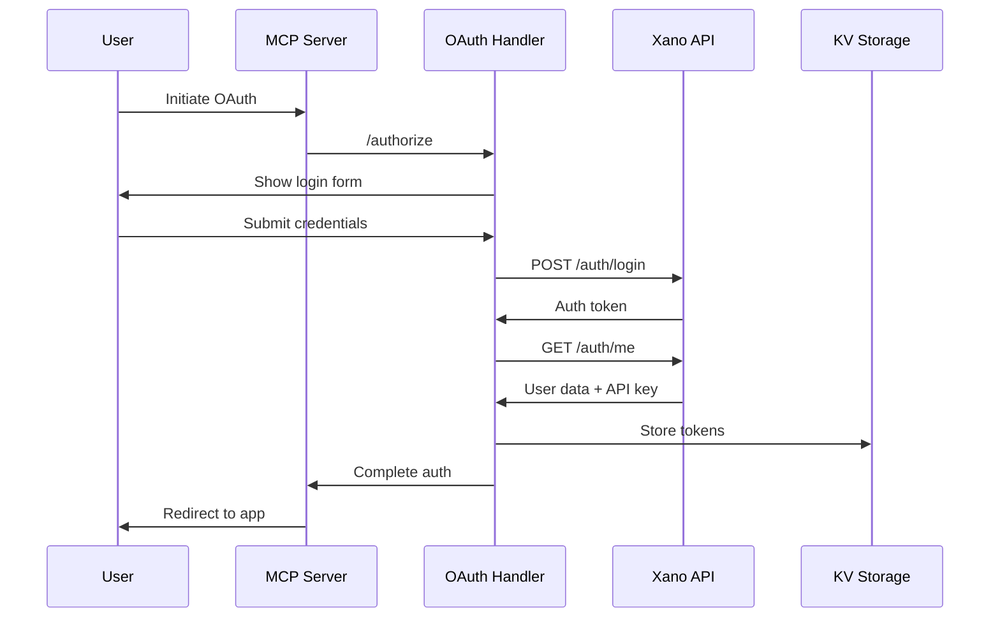
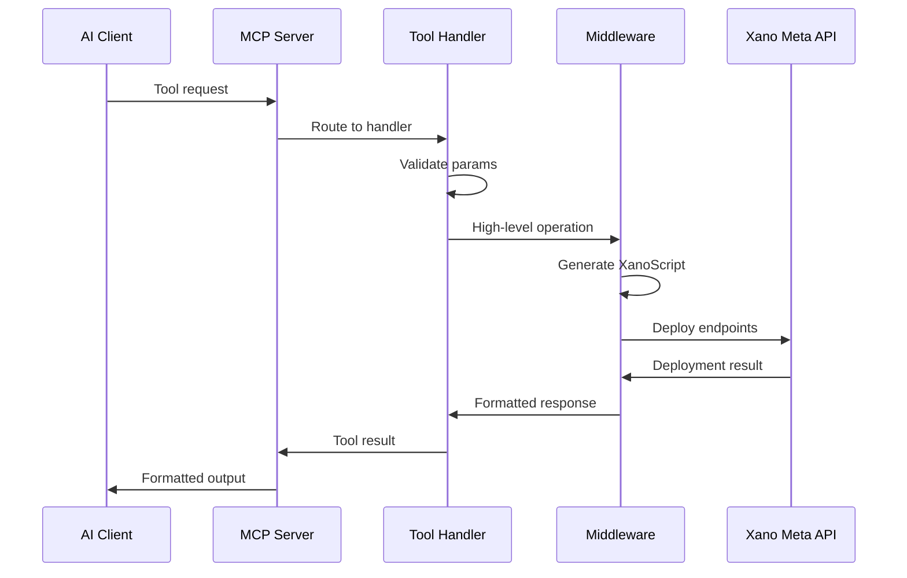

# Xano MCP System Architecture

## Overview

The Xano MCP (Model Context Protocol) system is a sophisticated three-tier architecture that bridges AI assistants (like Claude) with Xano's backend-as-a-service platform. Through intelligent SDK translation, bulletproofing features, and performance optimizations, it achieves 82%+ deployment success rates while reducing token usage by 99%.

## System Components

### 1. MCP Server (Cloudflare Worker)
The core of the system, deployed as a Cloudflare Worker with Durable Objects for state management.

**Key Responsibilities:**
- MCP protocol implementation and tool registration
- OAuth 2.0 authentication flow management
- Session state persistence via Durable Objects
- Request routing to appropriate handlers
- Token management and refresh

**Technology Stack:**
- Cloudflare Workers (serverless compute)
- Durable Objects (stateful session management)
- KV Storage (persistent data storage)
- Hono framework (lightweight web routing)

### 2. Middleware Layer (Express.js)
A separate Express.js application that provides high-level SDK functionality.

**Key Responsibilities:**
- XanoScript SDK hosting and generation
- Complex operation templating
- Batch operation orchestration
- SDK route generation and management

**Technology Stack:**
- Express.js server
- XanoScript SDK (FluentBuilder)
- Reusable component libraries
- Template generators

### 3. Dashboard (Next.js)
A user-facing web application for account management and monitoring.

**Key Responsibilities:**
- User authentication UI
- API key management
- Usage monitoring and analytics
- Documentation hosting

**Technology Stack:**
- Next.js 14 with App Router
- Tailwind CSS
- Framer Motion
- Vercel deployment

## Architecture Patterns

### 1. Fluent API / Builder Pattern
The XanoScript SDK uses a fluent interface for intuitive script generation:

```javascript
const endpoint = create('get-user', 'GET')
  .requiresAuth('users')
  .input('id', 'int', { required: true })
  .dbGet('users', { id: '$input.id' }, 'user')
  .response('$user');

return endpoint.build().script;
```

### 2. Command Pattern
Each MCP tool acts as a command, encapsulating complex operations:

```typescript
this.server.tool(
  "create_crud_system",
  CRUDSystemSchema,
  async (params) => {
    // Command execution logic
  }
);
```

### 3. Facade Pattern
Middleware tools provide simple interfaces to complex Xano operations:

```javascript
// Simple facade call
createCRUDSystem({ table: 'products' })

// Hides complex orchestration:
// 1. Validate table exists
// 2. Create API group
// 3. Generate 5 CRUD endpoints
// 4. Deploy all endpoints
// 5. Return formatted results
```

### 4. Pipeline Pattern
Data transformation through composable filters:

```javascript
FluentBuilder.chain('$user.name', 'trim', 'lower', 'capitalize')
// Generates: $user.name|trim|lower|capitalize
```

## Data Flow

### 1. Authentication Flow


### 2. Tool Execution Flow


## Security Architecture

### Authentication Layers
1. **OAuth 2.0 Flow**: Secure user authentication
2. **API Key Management**: Personal Access Tokens stored in KV
3. **Session Management**: Durable Objects maintain user state
4. **Token Refresh**: Automatic token renewal on 401 responses

### Security Measures
- All tokens encrypted in KV storage
- HTTPS-only communication
- Rate limiting capabilities
- Precondition checks in generated XanoScript
- Table and field validation before operations

## Scalability Design

### Horizontal Scaling
- **Cloudflare Workers**: Auto-scales globally across 200+ data centers
- **Stateless Computation**: Each request independent
- **Durable Objects**: Regional isolation for session state
- **KV Storage**: Eventually consistent global storage

### Performance Optimizations
1. **Token Efficiency**: 99% reduction through middleware patterns
2. **Batch Operations**: Multiple operations in single requests
3. **Caching Strategy**: KV storage for session data
4. **Parallel Execution**: Promise.all for independent operations

## Component Boundaries

### MCP Server Responsibilities
- Protocol implementation
- Authentication management
- Tool registration and discovery
- Session state management
- Error formatting and propagation

### Middleware Responsibilities
- XanoScript generation
- Template management
- Complex orchestration
- SDK operations
- Batch processing

### Dashboard Responsibilities
- User interface
- Account management
- Documentation
- Analytics and monitoring

## Extension Points

### Adding New Tools
1. Define tool schema with Zod
2. Implement handler function
3. Register with MCP server
4. Add documentation

### Custom Templates
1. Create template in high-level-tools
2. Add to middleware router
3. Expose through MCP tool

### Filter Extensions
1. Add to filter registry
2. Implement in operations module
3. Update validation logic

## Monitoring and Observability

### Logging System
- Request/response logging to Xano
- Error tracking with context
- Performance metrics collection
- User activity monitoring

### Health Checks
- Endpoint health monitoring
- Dependency status checks
- Performance baseline tracking

## Key Innovations

### 1. XanoScript Translation Pipeline
- **Multi-layer auto-fixing**: Corrects 65% of common AI mistakes
- **Bulletproofing features**: Handles edge cases and syntax variations
- **Global function support**: buildObject() and buildArray() available without imports
- **Filter chain optimization**: Combines sequential operations for performance

### 2. Token Efficiency
- **99% reduction** in token usage through SDK abstraction
- **Pattern templates** for common operations
- **Response previews** limited to 200 characters
- **Cached compilations** for repeated deployments

### 3. Error Recovery
- **Classification system**: Maps errors to specific categories with targeted fixes
- **Multi-level validation**: Pre-flight, compilation, and deployment checks
- **Intelligent suggestions**: Context-aware error messages and solutions
- **Automatic retries**: Smart retry logic with exponential backoff

## Performance Metrics

### Translation Performance
- SDK code execution: 15-30ms
- Auto-fix processing: 5-10ms
- XanoScript generation: 10-20ms
- Xano API deployment: 200-500ms
- **Total end-to-end: 250-600ms**

### Success Rates
- Initial AI generation: ~35% success
- After auto-fixing: 82%+ success
- With error guidance: 95%+ eventual success

### Resource Efficiency
- Cloudflare Workers: <10ms cold start
- Middleware caching: 5-minute TTL
- Connection pooling: Reuses Xano clients
- Batch processing: 5 concurrent operations

## Future Architecture Considerations

### Planned Improvements
1. **AST-Based Translation**: Parse SDK to AST for more reliable transformation
2. **Type-Safe SDK**: Full TypeScript definitions with compile-time validation
3. **Visual Builder**: Bidirectional sync between visual flow and SDK code
4. **Real-time Validation**: IDE plugins for instant feedback
5. **GraphQL Federation**: Unified API across all components

### Scaling Enhancements
1. **Edge Caching**: Deploy compilation cache to edge locations
2. **WebSocket Support**: Real-time deployment status and logs
3. **Event-Driven Architecture**: Decouple components with event bus
4. **Horizontal Scaling**: Distribute middleware across regions
5. **Observability**: OpenTelemetry integration for distributed tracing

## Related Documentation

- [XanoScript Translation](./xanoscript-translation.md) - Deep dive into SDK to XanoScript conversion
- [System Communications](./system-communications.md) - Component interaction and data flow
- [SDK Reference](/sdk-reference/sdk-internals.md) - Complete SDK documentation