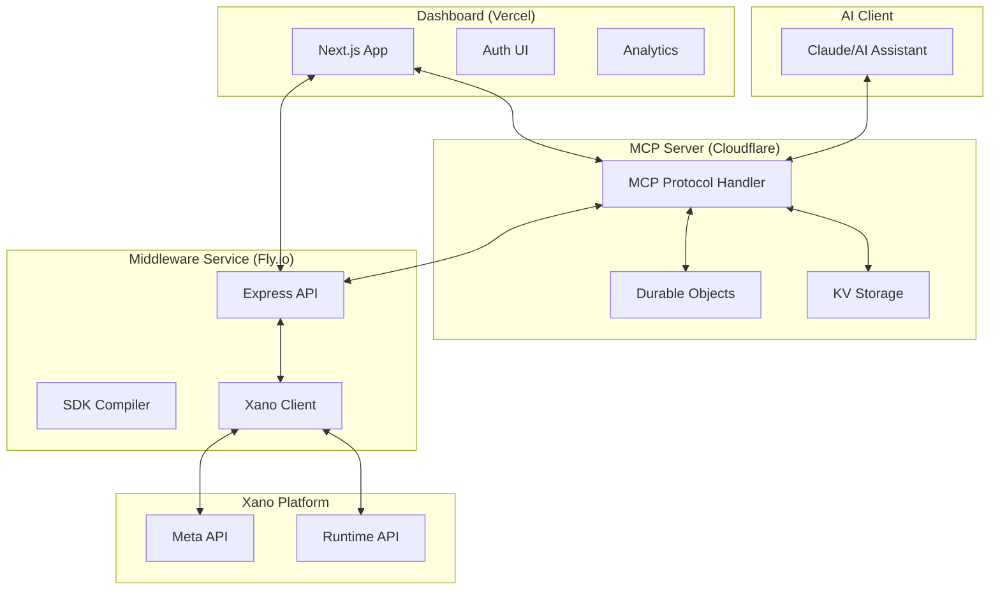
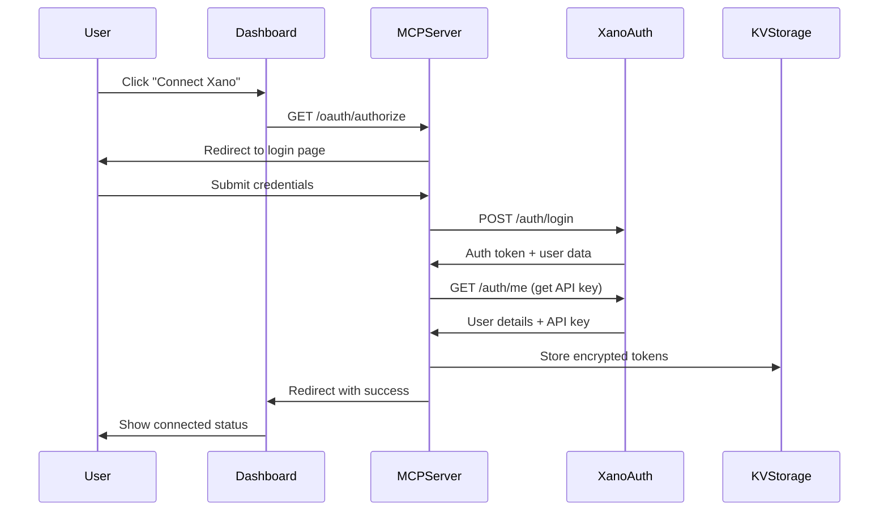
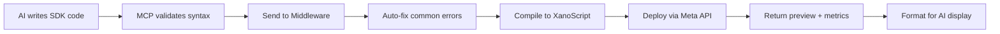

# System Communications Architecture

## Overview

The Xano MCP ecosystem consists of three primary components that communicate through well-defined interfaces: the MCP Server (Cloudflare Worker), the Middleware Service (Express.js), and the Dashboard (Next.js). This document details how these components interact, their communication protocols, and data flow patterns.

## Component Architecture

### System Overview



## Communication Protocols

### 1. MCP Protocol (AI ↔ MCP Server)

The Model Context Protocol defines standardized communication between AI assistants and tools:

```typescript
// Tool Request
{
  "jsonrpc": "2.0",
  "method": "tool/call",
  "params": {
    "name": "deploy_sdk_code",
    "arguments": {
      "instance_name": "xivz-202s-g8gq",
      "workspace_id": 7,
      "api_group_id": 123,
      "sdk_code": "const endpoint = create('test', 'GET')..."
    }
  },
  "id": "1"
}

// Tool Response
{
  "jsonrpc": "2.0",
  "result": {
    "content": [
      {
        "type": "text",
        "text": "✅ Endpoint deployed successfully!"
      }
    ]
  },
  "id": "1"
}
```

### 2. HTTP REST (MCP Server ↔ Middleware)

Communication between MCP Server and Middleware uses authenticated HTTP REST:

```typescript
// Request to Middleware
POST https://snappy-middleware-old-star-2952.fly.dev/script-deploy/deploy-script
Authorization: Bearer ${API_KEY}
Content-Type: application/json

{
  "instance_name": "xivz-202s-g8gq",
  "workspace_id": 7,
  "api_group_id": 123,
  "sdk_code": "const endpoint = create('test', 'GET')...",
  "endpoint_name": "test-endpoint",
  "update_mode": "recreate"
}

// Response from Middleware
{
  "success": true,
  "result": {
    "api_id": 456,
    "endpoint_url": "https://xivz-202s-g8gq.n7.xano.io/api:ABC123/test",
    "xanoscript_preview": "query test verb=GET\n  response { value = { ok = true } }",
    "xanoscript_length": 52,
    "tokens_saved": 948,
    "pattern_used": "simple-endpoint"
  }
}
```

### 3. OAuth Flow (User ↔ MCP Server ↔ Xano)

Authentication flow for user authorization:



## Data Flow Patterns

### 1. SDK Deployment Flow

Complete flow from AI to deployed endpoint:



### 2. Error Handling Flow

Multi-layer error handling and recovery:

```javascript
// Layer 1: MCP Pre-validation
try {
  validateSDKSyntax(sdkCode);
} catch (syntaxError) {
  return formatError('SDK_SYNTAX', syntaxError, {
    suggestions: getSyntaxSuggestions(syntaxError)
  });
}

// Layer 2: Middleware Processing
try {
  const result = await middleware.deployScript(params);
} catch (middlewareError) {
  if (middlewareError.code === 'AUTH_EXPIRED') {
    await refreshToken();
    return retry();
  }
  return formatError('MIDDLEWARE', middlewareError);
}

// Layer 3: Xano Deployment
try {
  await xano.deployEndpoint(compiledScript);
} catch (xanoError) {
  return formatError('DEPLOYMENT', xanoError, {
    line: xanoError.line,
    suggestion: getXanoSuggestion(xanoError)
  });
}
```

### 3. State Management Flow

Using Durable Objects for session persistence:

```typescript
// Durable Object for user session
export class UserSession extends DurableObject {
  async fetch(request: Request) {
    const url = new URL(request.url);
    
    switch (url.pathname) {
      case '/store-token':
        const { token, apiKey } = await request.json();
        await this.state.storage.put('auth_token', encrypt(token));
        await this.state.storage.put('api_key', encrypt(apiKey));
        return new Response('OK');
        
      case '/get-token':
        const token = await this.state.storage.get('auth_token');
        return new Response(decrypt(token));
        
      case '/refresh':
        const newToken = await refreshXanoToken();
        await this.state.storage.put('auth_token', encrypt(newToken));
        return new Response('OK');
    }
  }
}
```

## Component Responsibilities

### MCP Server (Cloudflare Worker)

**Primary Responsibilities:**
- MCP protocol implementation
- Tool registration and discovery
- OAuth flow management
- Session state persistence
- Token encryption/decryption
- Request routing

**Key Interfaces:**
```typescript
// Tool Registration
this.server.tool("deploy_sdk_code", DeploySchema, deployHandler);
this.server.tool("update_sdk_code", UpdateSchema, updateHandler);

// OAuth Endpoints
router.get('/oauth/authorize', handleAuthorize);
router.get('/oauth/callback', handleCallback);
router.post('/oauth/refresh', handleRefresh);

// Session Management
router.get('/session/:userId', getSession);
router.post('/session/:userId', updateSession);
```

### Middleware Service (Express.js)

**Primary Responsibilities:**
- SDK code compilation
- XanoScript generation
- Auto-fix processing
- Template management
- Batch operations
- Error enhancement

**Key Endpoints:**
```javascript
// SDK Operations
app.post('/script-deploy/deploy-script', deployScript);
app.post('/script-deploy/update-script', updateScript);

// Template Operations
app.post('/templates/auth-system', createAuthSystem);
app.post('/templates/crud-system', createCRUDSystem);
app.post('/templates/stripe-integration', createStripeSystem);

// Utility Operations
app.post('/analyze/workspace', analyzeWorkspace);
app.post('/monitor/logs', fetchLogs);
```

### Dashboard (Next.js)

**Primary Responsibilities:**
- User authentication UI
- Account management
- Usage analytics
- Documentation hosting
- Visual configuration

**Key Features:**
```typescript
// Authentication
/dashboard/login
/dashboard/register
/dashboard/forgot-password

// Account Management
/dashboard/settings
/dashboard/settings/billing
/dashboard/settings/api-keys

// Analytics
/dashboard/overview
/dashboard/developers/events-&-logs
/dashboard/developers/api-keys
```

## Security Architecture

### 1. Token Management

```typescript
// Encryption at rest
const encryptedToken = await crypto.subtle.encrypt(
  { name: 'AES-GCM', iv },
  encryptionKey,
  encoder.encode(token)
);

// Token refresh strategy
if (response.status === 401) {
  const newToken = await refreshToken();
  await storeToken(userId, newToken);
  return retryRequest(request, newToken);
}
```

### 2. API Key Security

```javascript
// Middleware authentication
const authenticate = async (req, res, next) => {
  const apiKey = req.headers.authorization?.replace('Bearer ', '');
  
  if (!apiKey) {
    return res.status(401).json({ error: 'Missing API key' });
  }
  
  const isValid = await validateApiKey(apiKey);
  if (!isValid) {
    return res.status(401).json({ error: 'Invalid API key' });
  }
  
  next();
};
```

### 3. Rate Limiting

```typescript
// Cloudflare rate limiting
const rateLimiter = {
  windowMs: 60 * 1000, // 1 minute
  max: 100, // 100 requests per minute
  keyGenerator: (request) => {
    return request.headers.get('CF-Connecting-IP') || 'anonymous';
  }
};
```

## Performance Optimizations

### 1. Connection Pooling

```javascript
// Middleware connection pool
const xanoPool = new Map();

function getXanoClient(instance) {
  if (!xanoPool.has(instance)) {
    xanoPool.set(instance, new XanoClient({
      instance,
      maxRetries: 3,
      timeout: 30000
    }));
  }
  return xanoPool.get(instance);
}
```

### 2. Response Caching

```typescript
// KV cache with TTL
const CACHE_TTL = 300; // 5 minutes

async function getCachedResponse(key: string) {
  const cached = await env.KV.get(key, 'json');
  if (cached && cached.expires > Date.now()) {
    return cached.data;
  }
  return null;
}

async function setCachedResponse(key: string, data: any) {
  await env.KV.put(key, JSON.stringify({
    data,
    expires: Date.now() + CACHE_TTL * 1000
  }));
}
```

### 3. Batch Processing

```javascript
// Batch API calls
async function batchDeploy(endpoints) {
  const chunks = chunk(endpoints, 5); // Process 5 at a time
  const results = [];
  
  for (const chunk of chunks) {
    const chunkResults = await Promise.all(
      chunk.map(endpoint => deployEndpoint(endpoint))
    );
    results.push(...chunkResults);
  }
  
  return results;
}
```

## Monitoring and Observability

### 1. Request Logging

```javascript
// Structured logging
const logger = {
  info: (message, meta) => {
    console.log(JSON.stringify({
      timestamp: new Date().toISOString(),
      level: 'info',
      message,
      ...meta,
      requestId: getCurrentRequestId()
    }));
  }
};

// Log all requests
app.use((req, res, next) => {
  logger.info('Request received', {
    method: req.method,
    path: req.path,
    ip: req.ip,
    userAgent: req.headers['user-agent']
  });
  next();
});
```

### 2. Performance Metrics

```typescript
// Track operation timing
async function trackTiming(operation: string, fn: Function) {
  const start = performance.now();
  try {
    const result = await fn();
    const duration = performance.now() - start;
    
    await env.ANALYTICS.writeDataPoint({
      metric: `operation.${operation}.duration`,
      value: duration,
      tags: {
        status: 'success'
      }
    });
    
    return result;
  } catch (error) {
    const duration = performance.now() - start;
    
    await env.ANALYTICS.writeDataPoint({
      metric: `operation.${operation}.duration`,
      value: duration,
      tags: {
        status: 'error',
        error_type: error.constructor.name
      }
    });
    
    throw error;
  }
}
```

### 3. Health Checks

```javascript
// Component health endpoints
app.get('/health', async (req, res) => {
  const checks = {
    server: 'ok',
    xano: await checkXanoConnection(),
    database: await checkDatabaseConnection(),
    memory: process.memoryUsage(),
    uptime: process.uptime()
  };
  
  const isHealthy = Object.values(checks).every(
    check => check === 'ok' || typeof check === 'object'
  );
  
  res.status(isHealthy ? 200 : 503).json(checks);
});
```

## Future Communication Enhancements

### 1. WebSocket Support

```javascript
// Real-time deployment status
const ws = new WebSocket('wss://middleware.xano-mcp.com/deploy');

ws.on('message', (data) => {
  const status = JSON.parse(data);
  updateDeploymentProgress(status);
});
```

### 2. Event-Driven Architecture

```typescript
// Event bus for component communication
interface SystemEvent {
  type: 'deployment' | 'error' | 'auth' | 'analytics';
  payload: any;
  timestamp: number;
  source: string;
}

class EventBus {
  private subscribers = new Map<string, Set<Function>>();
  
  subscribe(event: string, handler: Function) {
    if (!this.subscribers.has(event)) {
      this.subscribers.set(event, new Set());
    }
    this.subscribers.get(event)!.add(handler);
  }
  
  emit(event: SystemEvent) {
    const handlers = this.subscribers.get(event.type);
    if (handlers) {
      handlers.forEach(handler => handler(event));
    }
  }
}
```

### 3. GraphQL Federation

```graphql
# Unified API across components
type Query {
  # From MCP Server
  currentUser: User
  sessions: [Session]
  
  # From Middleware
  deploymentHistory: [Deployment]
  templates: [Template]
  
  # From Dashboard
  analytics: Analytics
  settings: Settings
}

type Mutation {
  # Unified operations
  deployEndpoint(input: DeployInput!): DeployResult
  updateSettings(input: SettingsInput!): Settings
}
```